# Ray AI Shopper - Complete User Flow Diagram

## Overview
This diagram shows the complete user journey through the Ray AI Shopper application, including all frontend interactions, backend API calls, OpenAI integrations, and data flows.

```mermaid
flowchart TD
    %% User Journey Start
    A[User Lands on App] --> B[Step 1: Welcome Screen]
    B --> C[Step 2: About You Form]
    
    %% Step 2: User Profile Collection
    C --> D{User Fills Profile}
    D --> E[Gender Selection]
    D --> F[Style Preferences]
    D --> G[Color Preferences]
    D --> H[Article Type Preferences]
    E --> I[Step 3: Upload Inspiration]
    F --> I
    G --> I
    H --> I
    
    %% Step 3: Inspiration Images
    I --> J{User Uploads Images?}
    J -->|Yes| K[Process Base64 Images]
    J -->|No| L[Step 4: Upload Selfie]
    K --> L
    
    %% Step 4: Selfie Upload
    L --> M{User Uploads Selfie?}
    M -->|Yes| N[Store Base64 Selfie]
    M -->|No| O[Step 5: AI Processing]
    N --> O
    
    %% Step 5: AI Processing & API Calls
    O --> P[Show Loading Animation]
    P --> Q[Prepare Recommendation Request]
    
    %% Backend API Call 1: Recommendations
    Q --> R[POST /api/v1/recommendations]
    R --> S[Backend: RecommendationService]
    
    %% OpenAI Calls within Recommendations
    S --> T[OpenAI: Analyze Inspiration Images]
    T --> U[GPT-4o Vision API Call]
    U --> V[Extract Style Insights]
    V --> W[OpenAI: Create Enhanced Search Query]
    W --> X[GPT-4o-mini API Call]
    X --> Y[Generate Query Embedding]
    Y --> Z[text-embedding-3-large API Call]
    Z --> AA[Vector Similarity Search - FAISS]
    AA --> BB[OpenAI: Enhance Ranking]
    BB --> CC[GPT-4o-mini API Call]
    CC --> DD[Return Top 20 Recommendations]
    
    %% Response Back to Frontend
    DD --> EE[Response: RecommendationResponse]
    EE --> FF[Session ID + Product List]
    FF --> GG[Step 6: Display Recommendations]
    
    %% Step 6: Recommendation Display & Interactions
    GG --> HH[Show 5 Items from 20-item Pool]
    HH --> II{User Interaction}
    
    %% User Actions in Step 6
    II -->|Like| JJ[Add to Liked Items]
    II -->|Dislike| KK[Smart Rotation Logic]
    II -->|Try It On| LL[Virtual Try-On Modal]
    II -->|More Options| MM[Rotate 3 Items]
    II -->|Chat with Ray| NN[Fashion Assistant Chat]
    II -->|Add to Cart| OO[Shopping Cart]
    
    %% Smart Rotation System
    KK --> PP{Items Available in Pool?}
    PP -->|Yes| QQ[Replace from Pool]
    PP -->|No| RR[POST /api/v1/refresh]
    QQ --> HH
    RR --> SS[Backend: Get Fresh Items]
    SS --> TT[Use Cached Embeddings]
    TT --> UU[Vector Search with Exclusions]
    UU --> VV[Return Fresh Items]
    VV --> WW[Update Pool]
    WW --> HH
    
    %% Virtual Try-On Flow
    LL --> XX[Enhanced Virtual Try-On Modal]
    XX --> YY[POST /api/v1/tryon]
    YY --> ZZ[Backend: Enhanced Analysis]
    
    %% OpenAI Calls for Virtual Try-On
    ZZ --> AAA[OpenAI: Analyze User Selfie]
    AAA --> BBB[GPT-4o Vision API Call]
    BBB --> CCC[Extract 15+ Facial Characteristics]
    CCC --> DDD[OpenAI: Analyze Product Image]
    DDD --> EEE[GPT-4o Vision API Call]
    EEE --> FFF[Extract Product Visual Details]
    FFF --> GGG[Construct Ultra-Detailed Prompt]
    GGG --> HHH[OpenAI: Generate Virtual Try-On]
    HHH --> III[DALL-E 3 API Call - HD Quality]
    III --> JJJ[Return Generated Image URL]
    JJJ --> KKK[Display Try-On Result]
    KKK --> LL
    
    %% Chat with Ray Flow
    NN --> LLL[Chat Modal Opens]
    LLL --> MMM[Auto-Generate Welcome Message]
    MMM --> NNN[POST /api/v1/chat]
    NNN --> OOO[Backend: Fashion Assistant]
    
    %% OpenAI Chat API Call
    OOO --> PPP[Prepare Full Context]
    PPP --> QQQ[User Profile + Recommendations + Journey Status]
    QQQ --> RRR[OpenAI: Chat with Assistant]
    RRR --> SSS[GPT-4o-mini API Call]
    SSS --> TTT[Fashion Expert Response]
    TTT --> UUU[Return Styling Advice]
    UUU --> VVV[Display in Chat]
    VVV --> WWW{Continue Chatting?}
    WWW -->|Yes| XXX[User Types Message]
    WWW -->|No| YYY[Close Chat]
    XXX --> NNN
    YYY --> HH
    
    %% Shopping Cart Flow
    OO --> ZZZ[Cart Management]
    ZZZ --> AAAA[Step 7: Checkout]
    AAAA --> BBBB[Review Selected Items]
    BBBB --> CCCC[Store Location Display]
    CCCC --> DDDD[Continue to Summary]
    
    %% Final Steps
    DDDD --> EEEE[Step 8: Summary]
    EEEE --> FFFF[Journey Complete]
    FFFF --> GGGG[Return to Step 6 or Exit]
    
    %% Feedback Processing
    JJ --> HHHH[POST /api/v1/feedback]
    HHHH --> IIII[Backend: Process Feedback]
    IIII --> JJJJ[Log User Preference]
    JJJJ --> HH
    
    %% Error Handling
    R -.->|Error| KKKK[Error Handler]
    YY -.->|Error| KKKK
    NNN -.->|Error| KKKK
    KKKK --> LLLL[Display Error Message]
    LLLL --> MMMM[Retry or Fallback]
    
    %% Styling
    classDef frontend fill:#e1f5fe,stroke:#01579b,stroke-width:2px
    classDef backend fill:#f3e5f5,stroke:#4a148c,stroke-width:2px
    classDef openai fill:#fff3e0,stroke:#e65100,stroke-width:2px
    classDef database fill:#e8f5e8,stroke:#1b5e20,stroke-width:2px
    classDef user fill:#fce4ec,stroke:#880e4f,stroke-width:2px
    
    %% Apply styles
    class A,B,C,D,E,F,G,H,I,J,K,L,M,N,O,P,Q,GG,HH,II,JJ,KK,LL,MM,NN,OO,XX,LLL,MMM,VVV,WWW,XXX,YYY,ZZZ,AAAA,BBBB,CCCC,DDDD,EEEE,FFFF,GGGG,LLLL,MMMM frontend
    class R,S,EE,FF,RR,SS,TT,UU,VV,WW,YY,ZZ,NNN,OOO,PPP,QQQ,UUU,HHHH,IIII,JJJJ,KKKK backend
    class T,U,V,W,X,Y,Z,BB,CC,AAA,BBB,CCC,DDD,EEE,FFF,GGG,HHH,III,JJJ,RRR,SSS,TTT openai
    class AA,DD database
    class KKK,GGGG user
```



## API Endpoints Summary

### 1. **POST /api/v1/recommendations**
**Request:**
```json
{
  "user_profile": {
    "shopping_prompt": "string",
    "gender": "Men|Women|Unisex",
    "preferred_styles": ["Casual", "Formal"],
    "preferred_colors": ["Blue", "Black"],
    "preferred_article_types": ["Shirts", "Pants"]
  },
  "inspiration_images": ["base64_string"],
  "top_k": 20,
  "session_id": "uuid"
}
```

**Response:**
```json
{
  "recommendations": [ProductItem],
  "total_available": 150,
  "session_id": "uuid",
  "query_embedding": [float] // dev only
}
```

### 2. **POST /api/v1/tryon**
**Request:**
```json
{
  "product_id": "string",
  "user_image": "base64_string",
  "style_prompt": "enhanced_context_prompt"
}
```

**Response:**
```json
{
  "generated_image_url": "https://...",
  "product_id": "string",
  "generation_prompt": "detailed_prompt",
  "success": true
}
```

### 3. **POST /api/v1/chat**
**Request:**
```json
{
  "message": "string",
  "context": {
    "user_profile": {},
    "current_recommendations": [],
    "journey_status": {}
  },
  "history": [ChatMessage],
  "session_id": "uuid"
}
```

**Response:**
```json
{
  "message": "fashion_expert_response",
  "context_updated": true,
  "suggestions": ["string"],
  "session_id": "uuid"
}
```

### 4. **POST /api/v1/refresh**
**Request:**
```json
{
  "session_id": "uuid",
  "exclude_ids": ["product_ids"],
  "count": 3
}
```

**Response:**
```json
[
  {
    "id": "string",
    "name": "string",
    "category": "string",
    // ... ProductItem fields
  }
]
```

### 5. **POST /api/v1/feedback**
**Request:**
```json
{
  "product_id": "string",
  "action": "like|dislike|save",
  "session_id": "uuid",
  "reason": "optional_string"
}
```

**Response:**
```json
{
  "success": true,
  "message": "Feedback recorded",
  "updated_recommendations": [ProductItem] // optional
}
```

## OpenAI API Calls Breakdown

### **GPT-4o Vision Calls:**
1. **Inspiration Image Analysis** - Extract style insights
2. **User Selfie Analysis** - 15+ facial characteristics
3. **Product Image Analysis** - Visual details for try-on

### **GPT-4o-mini Calls:**
1. **Search Query Enhancement** - Optimize user intent
2. **Recommendation Ranking** - AI-powered relevance scoring
3. **Fashion Chat Assistant** - Expert styling advice

### **Text-Embedding-3-Large Calls:**
1. **Query Embedding** - Convert search terms to vectors
2. **Batch Product Embeddings** - Pre-computed product vectors

### **DALL-E 3 Calls:**
1. **Virtual Try-On Generation** - HD photorealistic images
2. **Enhanced Prompts** - Ultra-detailed identity preservation

## Key Features Highlighted

1. **Smart Rotation System**: 20-item pool, display 5, instant replacements
2. **Enhanced Virtual Try-On**: 80-90% accuracy with dual analysis
3. **Context-Aware Chat**: Full journey context at Step 6
4. **Session Management**: Cached embeddings for consistency
5. **Error Resilience**: Comprehensive fallback systems
6. **Performance Optimization**: Batch processing, caching, lazy loading 